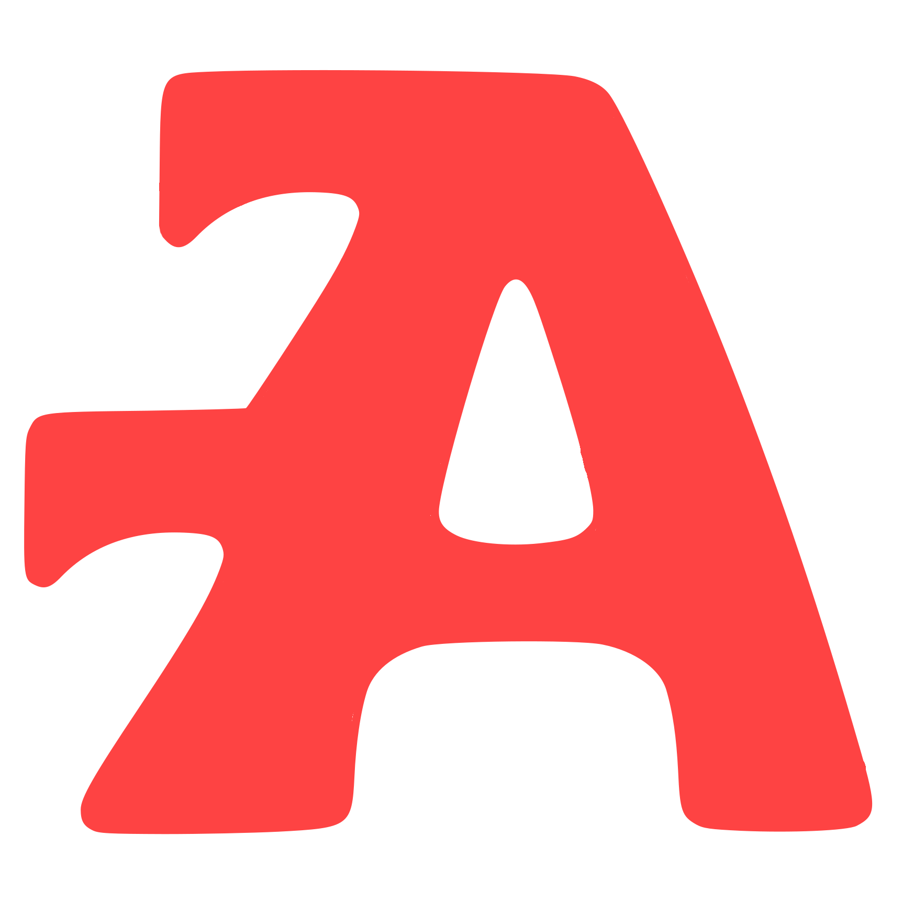

<a id="readme-top"></a>

<!-- PROJECT SHIELDS -->

[![Contributors][contributors-shield]][contributors-url]
[![Forks][forks-shield]][forks-url]
[![Stargazers][stars-shield]][stars-url]
[![Issues][issues-shield]][issues-url]
[![MIT License][license-shield]][license-url]

<!-- PROJECT LOGO -->
<br />
<div align="center">
  <a href="https://github.com/atlas77-lang/Atlas77">
    
  </a>

<h3 align="center">Atlas77</h3>

  <p align="center">
    An experimental statically typed systems programming language designed to be a goofy cousin to C++.
    <br />
    <a href="https://atlas77-lang.github.io/atlas77-docs/docs/latest/index.html"><strong>Explore the docs »</strong></a>
    <br />
    <br />
    <a href="https://atlas77-lang.github.io/atlas77-docs/playground.html">Playground</a>
    ·
    <a href="https://github.com/atlas77-lang/Atlas77/issues/new?labels=bug&template=bug-report---.md">Report Bug</a>
    ·
    <a href="https://github.com/atlas77-lang/Atlas77/issues/new?labels=enhancement&template=feature-request---.md">Request Feature</a>
  </p>
</div>

<!-- ABOUT THE PROJECT -->

## About The Project

Atlas77 is an experimental **statically typed systems language** designed around a **small core** and everything else be **userland**.
It runs on a **custom VM** and aims to provide a clear, minimal foundation for building higher-level abstractions in
libraries rather than in the compiler itself.
> [!Note]
> The VM will be reworked soon as it doesn't really fit the language design anymore.

The 2 core philosophies are simple:
- **Keep the core language tiny, make everything else userland.**
- **Safety opt-in: you pay for what you use.**

> [!Note] 
> If you find the code to be messy, it's because it kinda is. I am sort of "speedrunning" the bootstrapping of the language, so the Rust implementation is not really the main focus right now.

<!-- GETTING STARTED -->

## Getting Started

### Prerequisites

* Rust Compiler
  ```sh
  curl --proto '=https' --tlsv1.2 -sSf https://sh.rustup.rs | sh
  ```

Or directly from their website: [Rust](https://www.rust-lang.org/tools/install)

### Installation

1. Install it from Cargo
    ```sh
    cargo install atlas_77
    ```

> [!Note]
> I recommend you to build it yourself, as the version on Cargo is not up to date at all.
> The cargo version is lacking behind regarding bug fixes.

2. Use it as a CLI
    ```sh
    atlas_77 --help
    ```
3. Enjoy!

<!-- USAGE EXAMPLES -->

## Usage

### Hello World

```
import "std/io"
fun main() {
    println("Hello, World!");
}
```

### Fibonacci Example

```
import "std/io";

fun fib(n: int64) -> int64 {
    if n <= 1 {
        return n;
    }
    return fib(n - 1) + fib(n - 2);
}

fun main() {
    let n: int64 = 10;
    print(fib(n));
}
```

_For more examples, see the [examples folder](./examples/README.MD)_

<!-- FEATURES -->
## Features


<!-- ROADMAP -->

## Roadmap

### v0.1 & v0.2

There never was any official v0.1 or v0.2 releases, they were just internal milestones.

### v0.3 "Foundation"

> Deprecated, if you want to know more about the v0.3.x, check the releases page.

- [v0.3 "Foundation"](https://github.com/atlas77-lang/Atlas77/releases/tag/v0.3)
- [v0.3.1](https://github.com/atlas77-lang/Atlas77/releases/tag/v0.3.1)

### v0.4 "Keystone"

> Deprecated, if you want to know more about the v0.4, check the releases page.

> [!Warning] 
> This version no longer compiles for some reason, so the source code is still accessible, but you can't build it.

- [v0.4 "Keystone"](https://github.com/atlas77-lang/Atlas77/tag/v0.4)

### v0.5 "Phoenix"

The v0.5 was a complete rewrite of Atlas77, but because of some major design issues in syntax, semantic, memory
management, compiler and everything it didn't get any more updates after the v0.5.2 (which is still accessible).

> Deprecated, if you want to know more about the v0.5.x, check the releases page.

- [v0.5 "Phoenix"](https://github.com/atlas77-lang/Atlas77/tag/v0.5)
- [v0.5.1](https://github.com/atlas77-lang/Atlas77/tag/v0.5.1)
- [v0.5.2](https://github.com/atlas77-lang/Atlas77/tag/v0.5.2)

### v0.6.x "Bastion"

The v0.6.x series was a redesign of Atlas77 using everything that worked in the v0.5, but making it better and more consistent.
It introduced a lot of new features and improvements, including, but not limited to:
- **Generics** for functions and structs (not for struct methods yet)
- Multi file projects that works similarly to this semantically (yes it's bad, but it will be fixed in later versions):
> ```c
> #ifndef MYMODULE_ATLAS77
> #define MYMODULE_ATLAS77
> #endif
> ```
- **Unions** to allow for more flexible data structures
- **Enums**, only the C-like enums are supported for now
- Static access to struct methods (no static fields yet)
- **References** with `&` and dereferencing with `*`
> NB: They are kinda broken in this version, it's fixed in v0.7.x
- Improved standard library with more modules and functions
- Many bug fixes and performance improvements
- Introducing of `std::copyable` constraints for generics to allow only copyable types
> It's only there for the groundwork of move/copy semantics in v0.7.x

> Deprecated, if you want to know more about the v0.6.x, check the releases page.

- [v0.6.0-dev](https://github.com/atlas77-lang/Atlas77/releases/tag/v0.6.0-dev)
- [v0.6.0-dev2](https://github.com/atlas77-lang/Atlas77/releases/tag/v0.6.0-dev2)
- [v0.6.0 "Bastion"](https://github.com/atlas77-lang/Atlas77/releases/tag/v0.6.0)
- [v0.6.1](https://github.com/atlas77-lang/Atlas77/releases/tag/v0.6.1)
- [v0.6.2](https://github.com/atlas77-lang/Atlas77/releases/tag/v0.6.2)
- [v0.6.3](https://github.com/atlas77-lang/Atlas77/releases/tag/v0.6.3)
- [v0.6.4](https://github.com/atlas77-lang/Atlas77/releases/tag/v0.6.4)

### v0.7.x "Covenant"

This version will focus on correctness, fix

- Introduction of **move/copy semantics** to enable safer code and automatic scope cleanup
- Rework of the `_copy` constructor semantics
- Expansion and stabilization of parts of the standard library
- Introduction of `memcpy<T>(&T) -> T` for explicit shallow copies
- Addition of a **HIR pretty printer** to inspect the output of the compiler after the last HIR pass.

#### Stability and Refinement

> As the language is still in alpha (not 1.0 yet), I won't make "alpha"/"beta" build, it doesn't really make sense.

The beta phase (before v1.0.0) will focus on stabilizing the language. All features will be finalized,
tested extensively, and optimized for real-world use. This phase will serve as a release candidate.

See the [open issues](https://github.com/atlas77-lang/Atlas77/issues) for a full list of proposed features (and known
issues).

### Philosophy

I am making this language for myself, to learn more about programming languages, compilers, VMs and all that stuff.

I'll try to make it easy to use, but still a bit "cringey". I hope I can at least hit one of the long-term goals.

### Long-Term Goals

- Bootstrapping the compiler in Atlas77 itself
- Building a minimal ECS in pure Atlas77
- Building a simple game engine with OpenGL bindings
- Providing a package manager written in Atlas77
- LSP support for editors

<!-- CONTRIBUTING -->

## Contributing

Contributions are what make the open source community such an amazing place to learn, inspire, and create. Any
contributions you make are **greatly appreciated**.

If you have a suggestion that would make this better, please fork the repo and create a pull request. You can also
simply open an issue with the tag "enhancement".
Don't forget to give the project a star! Thanks again!

1. Fork the Project
2. Create your Feature Branch (`git checkout -b feature/AmazingFeature`)
3. Commit your Changes (`git commit -m 'Add some AmazingFeature'`)
4. Push to the Branch (`git push origin feature/AmazingFeature`)
5. Open a Pull Request

### Top contributors:

<a href="https://github.com/atlas77-lang/atlas77/graphs/contributors">
  
</a>

Made with [contrib.rocks](https://contrib.rocks).

## Special thanks

Here is a list of repositories that helped me a lot while making Atlas77:
> I either used them as inspiration, reference or learning material.

- [Margarine](https://github.com/todaymare/margarine)
- [Nova-Lang](https://github.com/pyrotek45/nova-lang/tree/main)
- [Rust](https://github.com/rust-lang/rust)

<!-- LICENSE -->

## License

Distributed under the MIT License. See `LICENSE.txt` for more information.

<!-- CONTACT -->

## Contact

Your Name - [@Gipson62_8015](https://twitter.com/Gipson62_8015) - J.H.Gipson62@gmail.com

Project Link: [https://github.com/atlas77-lang/Atlas77](https://github.com/atlas77-lang/Atlas77)


<!-- MARKDOWN LINKS & IMAGES -->
<!-- https://www.markdownguide.org/basic-syntax/#reference-style-links -->

[contributors-shield]: https://img.shields.io/github/contributors/atlas77-lang/Atlas77.svg?style=for-the-badge

[contributors-url]: https://github.com/atlas77-lang/Atlas77/graphs/contributors

[forks-shield]: https://img.shields.io/github/forks/atlas77-lang/Atlas77.svg?style=for-the-badge

[forks-url]: https://github.com/atlas77-lang/Atlas77/network/members

[stars-shield]: https://img.shields.io/github/stars/atlas77-lang/Atlas77.svg?style=for-the-badge

[stars-url]: https://github.com/atlas77-lang/Atlas77/stargazers

[issues-shield]: https://img.shields.io/github/issues/atlas77-lang/Atlas77.svg?style=for-the-badge

[issues-url]: https://github.com/atlas77-lang/Atlas77/issues

[license-shield]: https://img.shields.io/github/license/atlas77-lang/Atlas77.svg?style=for-the-badge

[license-url]: https://github.com/atlas77-lang/Atlas77/blob/master/LICENSE.txt
